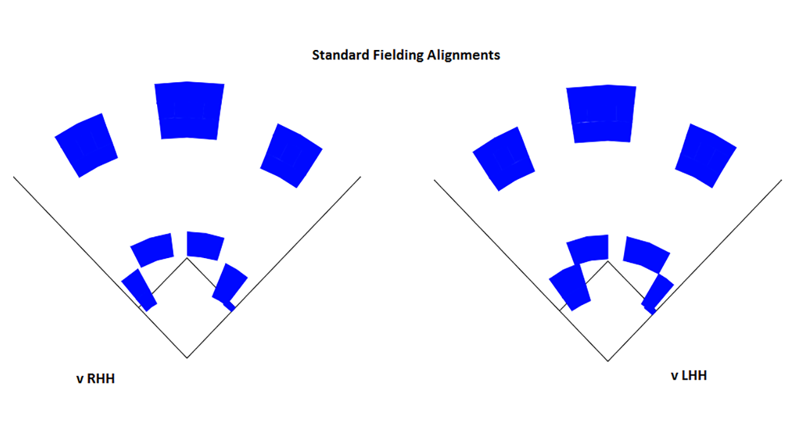
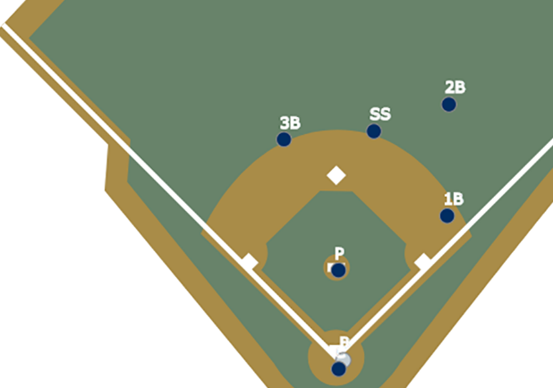
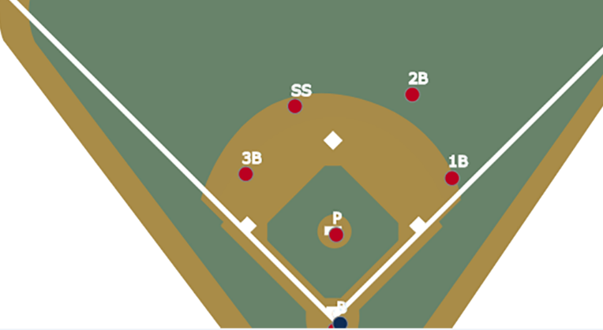
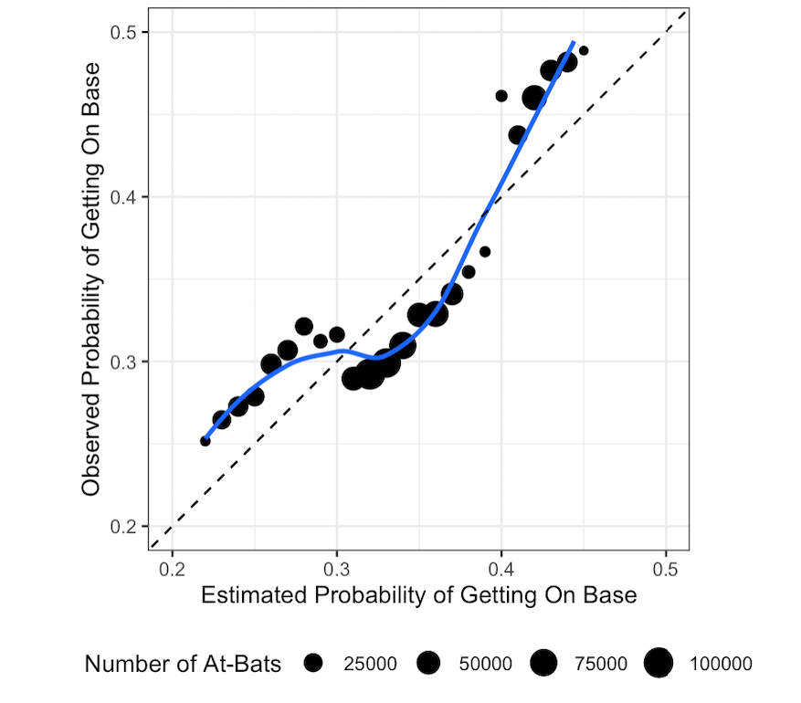

```{r setup, include=FALSE}
knitr::opts_chunk$set(echo = FALSE, warning = FALSE, message = FALSE)
```

```{r, include = FALSE}
# Load baseballr, Other Packages, and Data

library(baseballr)
library(glue)
library(tidyverse)
library(knitr)

statcast_at_bat_model_data <- read_rds("data/statcast_at_bat_model_data.rds")

# Shift count table
shift_count_table <- readRDS("data/tables/shift_count_table.RDS")

# Confidence interval tables
conf_int_table_3B<- readRDS("data/tables/conf_int_table_3B.RDS")
conf_int_table_no_3B <- readRDS("data/tables/conf_int_table_no_3B.RDS")

# OF Alignment Bar Plot
removing_OF <- readRDS("data/tables/removing_OF.RDS")

# Modeling Plots
logit_model_plot_main <- read_rds("data/tables/logit_model_plot_main.rds")

logit_model_plot_faceted <- read_rds("data/tables/logit_model_plot_faceted.rds")
```

## Introduction {.tabset, .tabset-pills}

Per MLB, shifting describes the situational defensive realignment of fielders away from their “traditional” (or for our purposes, standard) starting positions. Given that most recent discussion around shifting has been focused on defensive movement in the infield, we will center our analysis on the infield. [Statcast](https://www.mlb.com/glossary/statcast/shifts) defines infield positioning in three ways:

### Standard

  **1. Standard** - The infield is in their traditional positions.

{width=50%, height=50%}

### Infield Shift

  **2. Infield Shift** - Three or more infielders are positioned on one side of second base. 

{width=50% height=50%}
  
### Strategic  

  **3. Strategic** - A catch-all category for positioning that does not fit either category.
  
{width=40% height=40%}
  
## {-}

In recent years, the shift has become the topic of heated debate in the baseball world. As use of the shift has increased, the number of people in opposition has grown as well. The counterargument is built on the idea that the shift “steals” hits at a rate that puts hitters at a significant disadvantage, relative to the defense. According to [Zachary Rymer of Bleacher Report](https://bleacherreport.com/articles/10028942-a-shift-ban-is-the-game-changer-mlb-needs-right-now), between 2015 and 2016, hard hit balls (exit velocity of 95+ MPH) to the pull side resulted in a hit 58 percent of the time. This number is down to 50 percent for 2020 and 2021, with left-handed hitters suffering more than their right-handed counterparts. Shifting trends are observed to be different for right-handed hitters, a phenomenon that will serve as the main motivation for our work. 

Tom Tango looks into this in [The Psychology of the Infield Shift](https://batflipsandnerds.com/2021/02/03/the-psychology-of-the-infield-shift/), highlighting that wOBA is the main differentiator between the shift’s effect on righties versus lefties. Similar to on-base percentage, [wOBA](https://www.mlb.com/glossary/advanced-stats/weighted-on-base-average) expands further to account for how a player reached base. The value for each way of reaching base is determined by how much an event is worth relative to projected runs scored, so some outcomes (doubles) are worth more than others (singles). In Tango’s work, lefties displayed a lower wOBA when shifted against, while wOBA increases for righties, both relative to non-shifted situations. We will also look into [BABIP](https://www.mlb.com/glossary/advanced-stats/babip) which measures batting average exclusively on balls in play, excluding several batted-ball outcomes that do not involve the influence of the defense, such as homeruns. However, given the right-handed hitter phenomenon, wOBA is the primary statistic of interest for our analysis.
 
## The `baseballr` Package

For our work, we accessed pitch-by-pitch Statcast data from the [baseballR package (Bill Petti)](https://cran.r-project.org/web/packages/baseballr/baseballr.pdf). This dataset contained pitch-level information dating back to 2015, when Statcast technology was introduced in all 30 MLB stadiums. The initial dataset had 93 variables per observation; however, during preprocessing, we performed several transformations to prepare the dataset for analysis:

  - Removed all columns with only NA values.
  
  - Grouped event and description columns for different types of strikeouts, so strikeout descriptions in the resulting column include whether the strikeout was *swinging, looking,* or *other* (a catch-all for foul bunts, dropped third strikes, etc.).
  
  - Added an at-bat column to keep track of the number of at-bats per player per game (at-bat #1, #2, etc.).
  
  - Grouped pitch types into general categories: *Fastball, Breaking Ball,* and *Changeup*.
  
  - Grouped strike out zones, which were initially divided into 14 regions: *Inside, Outside, Middle,* and *Out of Zone*. 

After preprocessing, each observation had 88 variables, such as:

  - Game Year, Game Date, Game Type (Spring Training, Regular Season)

  - Pitcher and Batter Identifiers (Name, Unique ID, Handiness)
  
  - Game Information (Score, Outs, Runners On-Base, Inning)

  - Pitch Information (Pitch Type, Pitch Location, Pitch Outcome)
  
  - Positional (Shifting) Data
  
    - We grouped the infield fielding alignments into two categories to reduce the number of shift  identifiers: 
    
      - **Strategic and Standard were grouped into Standard**: Since strategic shifts are only “slight” variations of traditional alignment and do not encapsulate the focus of our analysis. 
    
      - **Infield shift was reclassified as Shift**.

  - Player Statistics (wOBA, BABIP)
    
    - We also calculated our own player statistics: **walk rate** and **strikeout rate**.

After preprocessing, we also added several additional variables:

  - *Last_pitch_of_at_bat*: A true/false identifier that allowed us to filter observations by at-bat.
  
  - *Babip_value_with_NAs*: We replaced batted-ball outcomes that BABIP drops (homeruns, sac bunts, double play sac bunts) with NA values, excluding them from our BABIP calculation.

  - *Batter_instance_identifier*: A single-line identifier that groups batter ID, year, stand, and fielding alignment, which allows for easy matching when manipulating dataframes. 
  
In order to promote consistency within our analysis, we decided to observe individual years with assumed independence. Thus, players who had 200 or more plate appearances in multiple years were included as separate player instances. We used 200 as our threshold for at bats because it allows for the calculation of more stable performance statistics for each player. 

In order to account for switch hitters, we prefaced that the threshold of 200 or more plate appearances must be observed with a particular batting stance within a single season. If, for example, we observe a particular player with 200 or more at bats as a left-handed batter in addition to 200 or more at bats as a right-handed batter within a single season, this player will be included as two separate observations according to their stance. Given that both the **2020 season** (60 games played) and the **2022 season** (the season was not completed at the start of the project) have significantly fewer observations using this threshold, we elected to exclude these years from our analysis. 

**IMPORTANT NOTE:** For EDA purposes, we used all available data from 2015-2022, excluding 2020 and 2022. For modeling purposes, this range was reduced to 2019-2021, excluding 2020, as the large quantity of pitch-by-pitch data would be sufficient over this time interval.

## EDA

While the MLB has had a steady rise in shifting overall, left-handed batters see the shift in a significantly higher proportion of their plate appearances than that of right-handed batters. 

```{r, warning=FALSE}
# Left-handed table
prop_shift_left <- statcast_at_bat_model_data %>%
  group_by(game_year) %>%
  filter(stand == "L") %>%
  summarize(prop_at_bats_shifted = mean(if_fielding_alignment == "Shift"),
            stand)

# Right-handed table
prop_shift_right <-  statcast_at_bat_model_data %>%
  group_by(game_year) %>%
  filter(stand == "R") %>%
  summarize(prop_at_bats_shifted = mean(if_fielding_alignment == "Shift"),
            stand)

rbind(prop_shift_left, prop_shift_right) %>%
  ggplot(aes(x = as.numeric(game_year) + 2014, y = prop_at_bats_shifted, color = stand)) +
  geom_line() +
  scale_y_continuous(breaks = seq(0, 0.600, 0.100)) +
  labs(title = "Shifting Trends Since 2015", x = "Season", y = "Proportion of Shifted PAs",
       color = "Stand") +
  theme_bw()
```

**REMOVING GAMES:** During initial EDA, we discovered a high proportion of missing shift values in the Spring Training pitch data (~78%), as well as a low proportion of missing shift values in the Regular Season (~0.01%). From this, we chose to exclude the Spring Training data from each year, and all observations with missing shift values in either the infield or outfield alignment column. 

**OUTFIELD ALIGNMENTS:** Within each batter-pitcher matchup, the proportion of observations in which the outfield is shifted is relatively low, regardless of the alignment of the infield. According to [MLB.com](https://www.mlb.com/glossary/statcast/shifts), both cases we classify as a shifted outfield - ***Three OF on One Side of 2B*** and ***4th Outfielder*** - are considered extremely. ***Strategic shifting***, which we group with ***Standard***, only account for 7% of all situations, with the rest falling under the ***Standard***. This, in addition to Dr. Brodie's advice on which situations exhibit the most prominent shifting influences, led us to focus primarily on infield shifting alignment.

**INFIELD-IN:** In situations with a runner on third base and less than two outs, the infield may be shifted in. The strategic shift category contains a significant proportion of these scenarios - about 17% each of strategic-standard and strategic-strategic observations (infield-outfield). These situations often inflate offensive outcomes, as moving the infield-in shift promotes variance in run scoring to maximize win probability at the expense of expected runs allowed. To confirm this phenomenon, we looked at the differences in four offensive statistics - wOBA, BABIP, walk rate, and strikeout rate - between infield-in and non-infield-in situations. We used confidence intervals to verify that the differences were statistically significant:

## Confidence Intervals {.tabset}

### Infield-In

```{r}
confint(conf_int_table_3B, level = 0.95) %>%
  kable()
```

### Traditional Alignment

```{r}
confint(conf_int_table_no_3B, level = 0.95) %>%
  kable()
```

## {-}

To adjust for the influence of such situations, we decided to remove observations in which the infield could be shifted in. However, to ensure we were not excluding situations in which there was a runner on third base with less than two outs but the infield was not shifted in, we only removed the observations that fit the aforementioned condition and were marked as “shift”. 

## BABIP and wOBA Trends - By Batter Stand {.tabset}

### BABIP

```{r}
# BABIP over time
statcast_at_bat_model_data %>%
  mutate(game_year = as.numeric(game_year)) %>%
  mutate(game_year = case_when(game_year == 1 ~ 2015,
                               game_year == 2 ~ 2016,
                               game_year == 3 ~ 2017,
                               game_year == 4 ~ 2018,
                               game_year == 5 ~ 2019,
                               game_year == 6 ~ 2021)) %>%
  group_by(game_year, stand, if_fielding_alignment) %>%
  summarize(avg_babip = mean(babip, na.rm = TRUE),
            .groups = "drop") %>%
  ggplot(aes(x = game_year, y = avg_babip, color = if_fielding_alignment)) +
  geom_line() +
  labs(title = "BABIP Trends Since 2015", caption = "Excludes 2020 and 2022 seasons due to limited observations", x = "Year", y = "BABIP", color = "Fielding Alignment") +
  #scale_x_break(2020) +
  scale_x_continuous(breaks = seq(2015, 2021, 1)) +
  scale_y_continuous(breaks = seq(0.235, 0.350, 0.01)) +
  facet_wrap(~stand) +
  theme_bw()
```

BABIP follows a very similar trend between right-handed hitters and left-hand hitters, decreasing when each type of batter faces the shift.

  - This coincides with the tendency observed by [Zachary Rymer of Bleacher Report](https://bleacherreport.com/articles/10028942-a-shift-ban-is-the-game-changer-mlb-needs-right-now), as mentioned previously: hit rate on hard-hit balls is down over the last eight seasons.
  
  - Such a trend alludes to the idea that the primary factor in the right-handed batter phenomenon may not (directly) involve batted balls.

### wOBA

```{r}
# wOBA over time
statcast_at_bat_model_data %>%
  mutate(game_year = as.numeric(game_year)) %>%
  mutate(game_year = case_when(game_year == 1 ~ 2015,
                               game_year == 2 ~ 2016,
                               game_year == 3 ~ 2017,
                               game_year == 4 ~ 2018,
                               game_year == 5 ~ 2019,
                               game_year == 6 ~ 2021)) %>%
  group_by(game_year, stand, if_fielding_alignment) %>%
  summarize(avg_woba = mean(woba, na.rm = TRUE),
            .groups = "drop") %>%
  ggplot(aes(x = game_year, y = avg_woba, color = if_fielding_alignment)) +
  geom_line() +
  labs(title = "wOBA Trends Since 2015", caption = "Excludes 2020 and 2022 seasons due to limited observations", x = "Year", y = "wOBA", color = "Fielding Alignment") +
  #scale_x_break(2020) +
  scale_x_continuous(breaks = seq(2015, 2021, 1)) +
  scale_y_continuous(breaks = seq(0.325, 0.400, 0.01)) +
  facet_wrap(~stand) +
  theme_bw()
```

In most instances, the shift is effective against left-handed batters, as indicated by the decrease (or no change) seen in wOBA for such hitters. 

  - However, there is a relatively significant increase in wOBA for right-handed batters when they are shifted against, highlighting that right-handed hitters are finding a way to beat the shift.
  
  - Given that wOBA follows an opposite trend as BABIP, this reinforces the notion that factors outside of batted balls could convey how right-handed hitters are beating the shift.

## {-}

## Methodology {.tabset, .tabset-pills}

### V1 Methodology

Prior to modeling, we decided to create a more descriptive value capturing a player's wOBA:

  - Rather than looking at differences in wOBA as an average across each season, we elected to calculate the delta value of wOBA at the batter level between shifted and non-shifted plate appearances.
  
  - To weigh the delta values by the quantity of plate appearances, we used the harmonic mean:
    
      $$
      H = \frac{2*PA_{shifted}*PA_{non-shifted}} {PA_{shifted} / PA_{non-shifted}}
      $$


For our methodology, we focused on the trends of two offensive statistics: **wOBA** and **BABIP**. Both were provided at the pitch level, but we only focused on each value at the end of an at-bat, as those instances involved the actual effect of the shift, and at the seasonal level.

Our first instinct was to try fitting a linear model to decribe at bat level wOBA values. To model offensive outcomes at the at-bat level, we used several explanatory variables and interactions:

  - Year
  
  - Pitch Type - **Fastball, Changeup,** and **Breaking-Ball**
  
  - Infield Fielding Alignment
  
  - Strikezone Location - **Inside, Middle, Outside,** or **Out of the Zone**
  
  - Batter/Pitcher Matchup by Handedness
  
  - The Interaction Between Batter Stand, Pitcher Handedness, and Infield Alignment
  
  - Batter's Harmonic Mean Delta wOBA Value
  
However, as we assessed the conditions for this model, we realized that at bat level wOBA could not be modeled effectively by a linear model because it is not a continuous variable. Although it is numeric, it is discrete with different values corresponding to different at bat outcomes. In the residual plot below, we observed various linear patterns in the residuals. This prompted us to consider other methods of quantifying at bat outcomes.

**Quantifying At-Bat Outcomes**

First we considered what we consider to be a successful at bat. We contemplated whether we should consider any method of getting on base or only batted balls. However, because any method of reaching a base is considered a success for the offensive team, we decided that getting on base would be considered a successful at bat outcome. Alternatively, we considered not getting on base to be an unsuccessful at bat outcome. Since we were able to reduce at bat outcomes to be binomial, this led us to the logistic regression.


**Logistic - Binary At-Bat Outcomes**

We used a logistic regression model as a way to predict whether an at bat would be successful based on at bat level characteristics. If the batter successfully made it on base, we interpreted this as our positive outcome; if they got out, this was our negative outcome. 

As this model was our follow up to the aforementioned linear model, we included the same variables describing the at bat such as whether there was a shift, the batter's stance, pitcher handedness, pitch location, etc. The harmonic mean weighted delta wOBA value was used as an indicator of player skill on the season.

To assess the fit of our logistic model to our data, we plotted our predicted probability of a successful at bat versus the observed probability of a successful at bat:

{width=50% height=50%}

From this plot, we observed that our logistic regression resulted in three distinct groupings. It was evident that for both low and high probabilities of getting on base, our model was underpredicting and for moderate probabilities of getting on base our model was overpredicting.

Initially, we completed further EDA to determine if these groupings were influences by any levels of the categorical variables included in our model. However, none of such variables included in our model had three levels, so we quickly moved on to figuring out what else might be causing these relationships. This, we have started exploring but will discuss further as a part of our future work.

### V2 Methodology

After our V1 modeling yielded inconclusive results, we considered several options to move forward:

**Within-Batter Matching**

  - We considered within-batter matching (more specifically, propensity score matching) to further enhance our understanding of shifting trends and tendencies. This would also take into account the factors that influence the potential for a shift and help us look into what motivates a shift, controlled by batter.
  
**Logistic Regression with the Added GAM Model**

```{r, warning = FALSE}
logit_model_plot_main
```

  - Additionally, we looked into the breakdown of this predicted versus observed relationship by batter handedness and shift occurrence.

**Observing the Residual Patterns by Batter-Handedness and In-Field Alignment**

```{r, warning = FALSE}
logit_model_plot_faceted
```

However, we elected for a simpler approach to controlling for the influence of the batter, and focused our modeling on statistical inference rather than prediction.

To best gauge the differences between right-handed and left-handed batters against the shift, we split the data into two subsets: **right-handed hitters** and **left-handed hitters**. With this approach, as mentioned above, switch hitters would be treated as separate observations based on their handedness for a particular plate appearance. From here, we chose to use a logistic regression to perform statistical inference on each subset, as a logistic model would allow us to explore the relationship between a dependent, binary variable and one or more independent (or predictor) variables. 

Although our analysis revolves primarily around wOBA, such a variable is continuous and thus could not be used as our model’s dependent variable. To account for this, we created a new binary variable to assess whether the batter reaches base or not, as indicated by the wOBa value of a particular outcome. As mentioned previously, wOBA value is on a continuous scale of 0 to 1. Using this, our new binary on-base variable took a value of 0 if wOBA was equal to 0 (the batter did not get on-base) for a particular outcome, and a value of 1 if wOBA was not equal to 0 (the batter got on-base in some way, excluding reaching base on a fielder’s choice or an error). 

We also decided to control for two variables: **game year** and **batter**. By controlling for the year, we are able to observe changes in getting on-base independent of the effect of general year-to-year trends. As for the batter, controlling for this variable eliminates the effect of the hitter (ex: hitter tendencies, how good a player is, etc.) on our explanation of the on-base outcome.

We used several explanatory variables and interactions:
  - The Interaction Between Pitcher Handedness and Fielding Alignment
  - The Interaction Between Pitch Type - **Fastball**, **Changeup,** and **Breaking-Ball** - and Fielding Alignment
  - The Interaction Between Pitch Outcome and Fielding Alignment

## {-}
  
## Results


## Discussion

### Limitations 

We encountered several limitations with our exploratory work:

  - We elected to exclude observations from both 2020 and 2022, as both years did not include a full season’s worth of pitch data, and thus did not sufficiently represent year-long trends. 

  - The shifting categories are very broad and the differences between shift groupings is not distinct. Similarly, we did not have player positional information. Both of these limited our overall understanding of the specifics of each shift. 

  - Due to how we have handled players playing for multiple seasons and switch hitters we have violated independence assumptions. Because of this, we must be careful in assessing our conclusions.
  

### Future Work 


## Acknowledgements

We would like to thank **Dr. Adam Brodie** for pitching this project idea to us and for taking the time to meet with us and offer guidance along the way. Also, thank you to **Dr. Ron Yurko** for directing this program and for all the help and suggestions along the way. 

## References

[Baseball Savant](https://baseballsavant.mlb.com/statcast_search?hfPT=&hfAB=&hfGT=R%7C&hfPR=&hfZ=&stadium=&hfBBL=&hfNewZones=&hfPull=&hfC=&hfSea=2022%7C&hfSit=&player_type=pitcher&hfOuts=&opponent=&pitcher_throws=&batter_stands=&hfSA=&game_date_gt=&game_date_lt=&hfMo=&team=&home_road=&hfRO=&position=&hfInfield=&hfOutfield=&hfInn=&hfBBT=&hfFlag=&metric_1=&group_by=name&min_pitches=0&min_results=0&min_pas=0&sort_col=pitches&player_event_sort=api_p_release_speed&sort_order=desc#results)

[Bill Petti's baseballR Package](https://cran.r-project.org/web/packages/baseballr/baseballr.pdf)

[Glossary of Shifting Terms - MLB](https://www.mlb.com/glossary/statcast/shifts)